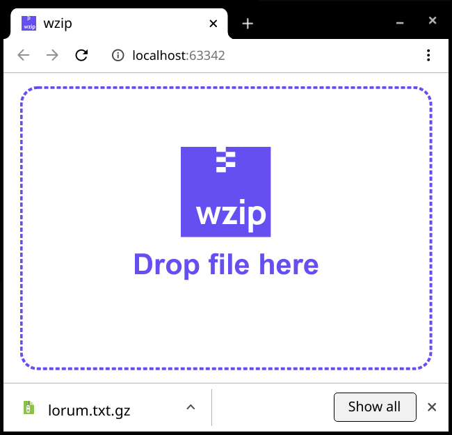

# WZIP<br/>GZIP + WASI

gzip implemented in Rust, able to be utilized in various environments

## Screenshots





## Install wasi compiler target
```rustup target add wasm32-wasi```

## Compile
```make```

## Environments
the `env` folder contains examples embeddings in different environments. All examples use the exact same `wzip.wasm` binary. 

- Browser
- Node.js CLI
- Node.js + Express.js
- Wasmtime

## Run with wasmtime
```wasmtime ./target/wasm32-wasi/release/wzip.wasm```